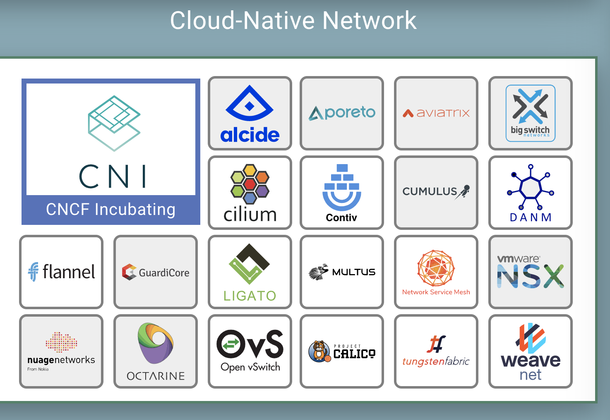
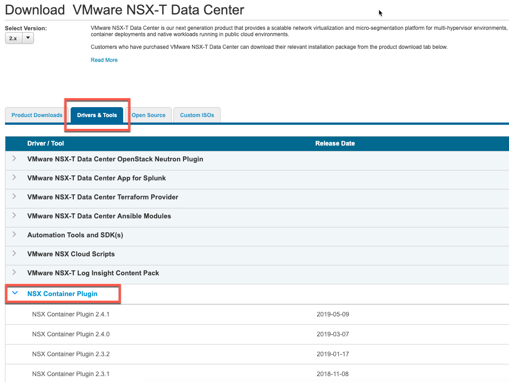

# NSX-T & K8S - PART 2

# Table Of Contents

[Container Network Interface (CNI)](#Container-Network-Interface)  
[NSX-T Components in Kubernetes Integration](#NSX-T-Components-in-Kubernetes-Integration)  
[NSX-T & K8S Overall Architecture](#NSX-T-&-K8S-Overall-Architecture)

# Container Network Interface
[Back to Table of Contents](#Table-Of-Contents)

* Container Network Interface (CNI) is a Cloud Native Computing Foundation (CNCF) project. It is a set of specifications and libraries to configure network interfaces in Linux containers. It has a pluggable architecture; hence third party plugins are supported. More info on CNI can be found [here](https://github.com/containernetworking/cni)   
Various solutions that have CNI plugin is listed [here](https://landscape.cncf.io/category=cloud-native-network&format=card-mode&grouping=category) by CNCF. A copy of the actual list is shown below (as of June 2019)

* Kubernetes uses CNI to support third party container networking solutions. More info can be found [here](https://kubernetes.io/docs/concepts/extend-kubernetes/compute-storage-net/network-plugins/#network-plugin-requirements) 

* VMware NSX-T CNI plugin comes within the "NSX-T Container" package as part of the downladable bits of NSX-T software from my.vmware.com. (shown below)

* NSX Container Plug-in for Kubernetes and Cloud Foundry - Installation and Administration Guide published [here](https://docs.vmware.com/en/VMware-NSX-T-Data-Center/index.html) guides the user on the installation steps and the definition of the different components used for the NSX-T and K8S integration. Below is our own view and comments. 

# NSX-T Components in Kubernetes Integration
[Back to Table of Contents](#Table-Of-Contents)

This section explains the components that are implemented by NSX-T platform to enable Kubernetes integration. More detailed information can be found in official NSX-T NCP installation guide
published [here](https://docs.vmware.com/en/VMware-NSX-T-Data-Center/2.4/com.vmware.nsxt.ncp_kubernetes.doc/GUID-FB641321-319D-41DC-9D16-37D6BA0BC0DE.html) 
##  The NSX Container Plugin (NCP) 

Per [NSX-T Documentation](https://docs.vmware.com/en/VMware-NSX-T-Data-Center/2.4/com.vmware.nsxt.ncp_kubernetes.doc/GUID-52A92986-0FDF-43A5-A7BB-C037889F7559.html) NCP is explained as following : NSX Container Plug-in (NCP) provides integration between NSX-T Data Center and container orchestrators such as Kubernetes, as well as integration between NSX-T Data Center and container-based PaaS (platform as a service) products such as OpenShift and Pivotal Cloud Foundry.

NCP is a container image that runs as an infrastructure K8S Pod on one of the worker nodes in the Kubernetes cluster. It is the management plane component that sits between the Kubernetes API Server (a Pod in K8s Master) and the NSX-T API (which is a service on NSX-T Manager). 

NCP creates a watch on Kubernetes API for any changes in "etcd" (K8S key/value database store). More info on "watch" can be found [here](https://kubernetes.io/docs/reference/using-api/api-concepts/#efficient-detection-of-changes)

As soon as any changes occur on an existing resource or a new resource gets created in etcd (i.e. namespace, pod, network policy, service) then Kubernetes API notifies NCP and then NCP sends out API calls towards NSX-T Manager API to realize the required logical networking constructs in the NSX-T platform (i.e. creating container interface (CIF) as a logical port on a logical switch, creating a logical switch, router, load balancer, NAT and distributed firewall rules etc.) 

For instance, 

- when a new namespace object is created in K8S, NCP captures this and creates a logical switch, a Tier 1 Logical Router and allocates an IP Pool for the PODs on NSX-T. It also allocates an SNAT IP for each NATed namespace (also provisions NAT rules on Tier 0 Logical Router)
- when Pods are created in a namespace on K8S, NCP captures this and allocates IP/MACs for each Pod on NSX-T.

NCP is deployed as a "ReplicaSet" as part of K8S "deployment". As mentioned above it always runs on one of the worker nodes.  Basically a ReplicaSet makes sure that a specified number of copies of that Pod are running at any given time. Hence as any "ReplicaSet" in K8S, its availability is guaranteed by K8S. More info on ReplicaSet can be found [here](https://kubernetes.io/docs/concepts/workloads/controllers/replicaset/)   

One other important thing to be aware of is, when NCP creates an object in NSX-T, it will put tags on them in NSX-T object datastore. Hence, even when NCP Pod fails and restarts, it can figure out which objects have already been created in NSX-T by NCP itself.

NCP container Image and the deployment yaml file (ncp-deployment.yaml) comes within the .zip file content as part of the NSX Container Plugin download from my.vmware.com.
 
## NSX Node Agent 

NSX Node Agent is also a container image that runs as an infrastructure POD on all of the worker nodes in the Kubernetes cluster. It is deployed as a K8S "DaemonSet".  A DaemonSet ensures that all or specific nodes run a copy of a Pod. When a node is added to the cluster, that node will have the respective Pod added to itself. More info on DaemonSet can be found [here](https://kubernetes.io/docs/concepts/workloads/controllers/daemonset/)

NSX Node Agent Pod has two containers. NSX Kube Proxy and NSX Node Agent.   
      
In K8S, the native Kube Proxy component provides distributed east-west load balancer (aka K8S Service Type : Cluster IP) based on IPTables (or IPVS lately). NSX Kube Proxy, on the other hand,leverages Open vSwitch (OVS) conntrack NAT feature, to provision flow rules on OVS to provide east-west distributed load-balancing. NSX Kube Proxy creates a watch on Kubernetes API for new K8S services which use the type Cluster IP. As soon as a new K8S service gets created with Cluster IP then NSX Kube Proxy provisions respective NAT translation rules and the server groups on OVS.  

NSX-T leverages Open vSwitch (OVS) on the K8S worker nodes. NSX Node Agent manages the OVS uplink and downlink configuration specifics; connecting the Kubernetes Pods to the OVS. Node Agent communicates with both NSX CNI Plugin and NSX Manager to achieve this. When a Pod is spun up on a K8S Node, NSX Node Agent is responsible for creating an OVS port and wiring that Pod to it and also tag the Pod' s traffic with the correct VLAN ID on the OVS uplink port (The use case of VLAN ID will be explained later on) Node Agent communicates with both NSX CNI Plugin and NSX Control Plane to achieve this.

## NSX CNI Plugin

* NSX CNI plugin is installed on all Kubernetes nodes. (Which is done in Part 3 of this series) 
* Kubelet, which is the K8S agent that runs on each Kubernetes Node, takes a set of PodSpecs (ie developer deploys an application with yaml file) that are provided through Kubernetes API. Kubelet then sends requests to the CNI Plugin to attach the Pods to the network. More info on kubelet can be found [here](https://kubernetes.io/docs/reference/command-line-tools-reference/kubelet/)

## Open vSwitch (OVS)

NSX-T leverages Open vSwitch to provide two functions : 
- container networking for K8S Pods
- east west load balancing (aka K8S Service Type Cluster IP)

# NSX-T & K8S Overall Architecture
[Back to Table of Contents](#Table-Of-Contents)

Below diagram shows how the overall architecture looks like. NSX Node Agent Pod, NSX Container Plugin Pod, the K8S deployment files for both Pods, OVS package and NSX CNI Plugin package will all be extracted and installed in the Part 3 of this series.

## [Part 3](https://github.com/dumlutimuralp/nsx-t-k8s/blob/master/Part%203/README.md)

