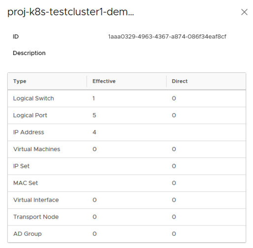
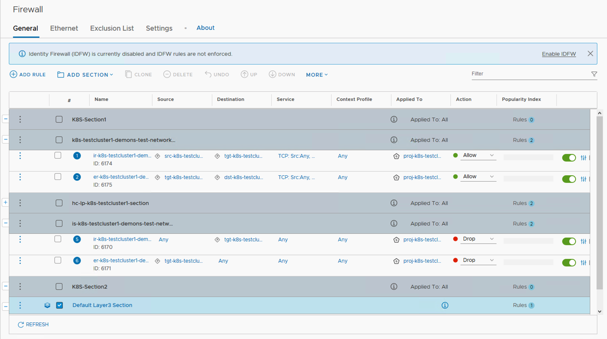
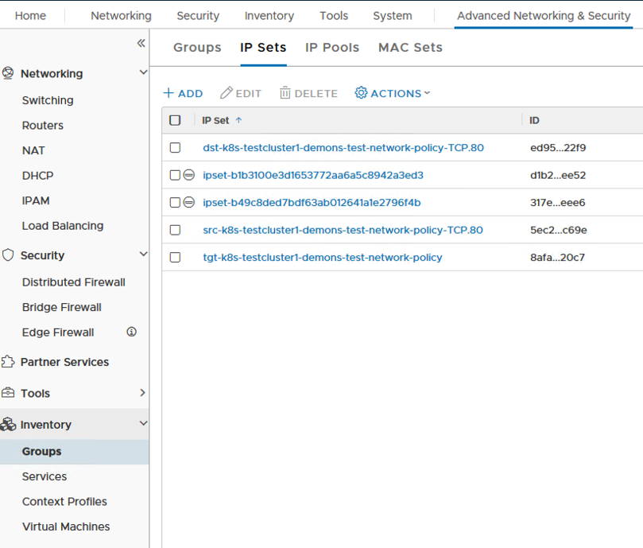
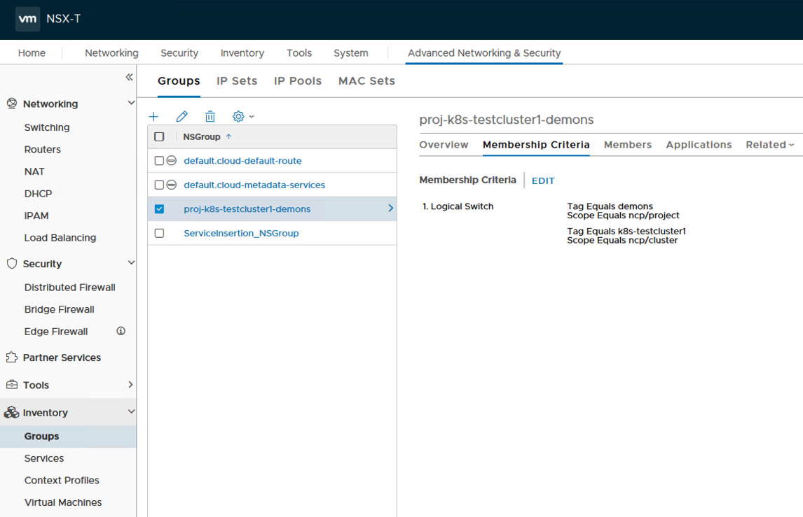
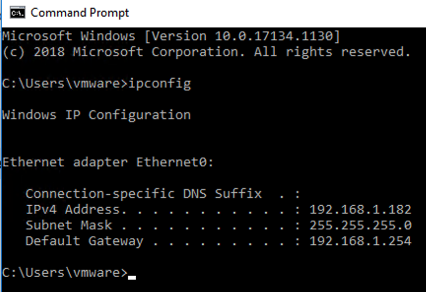
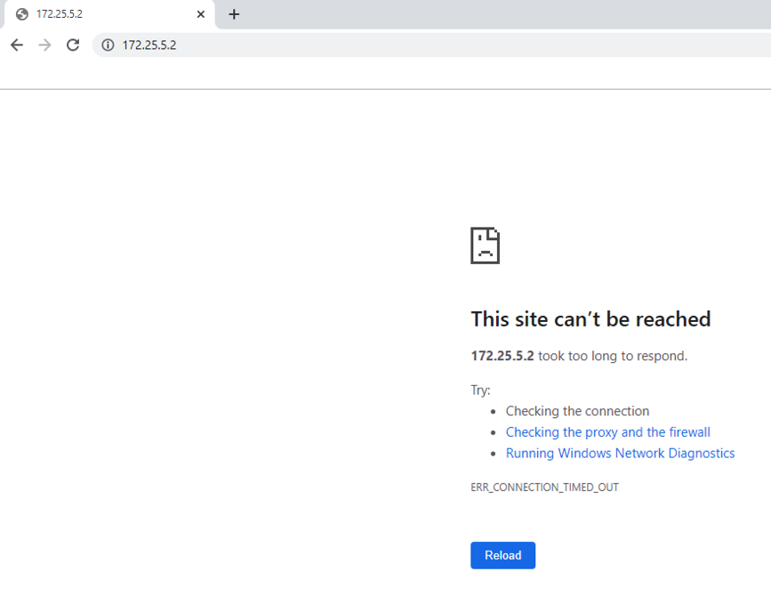
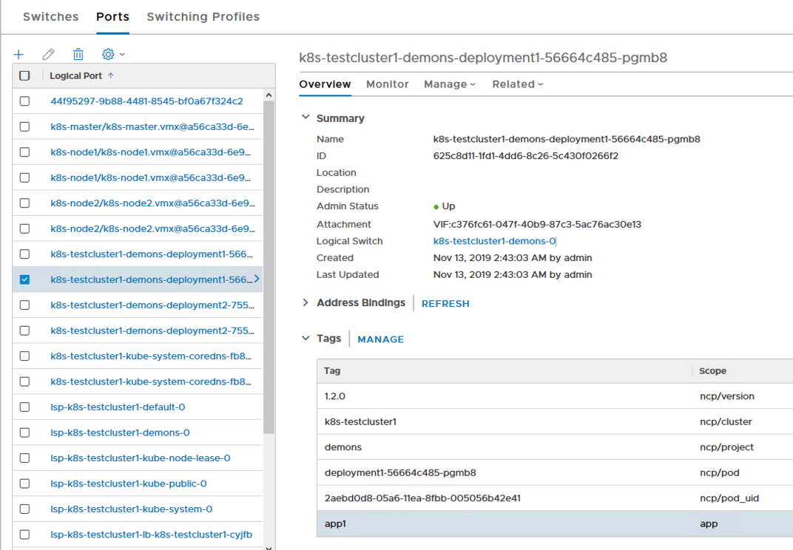
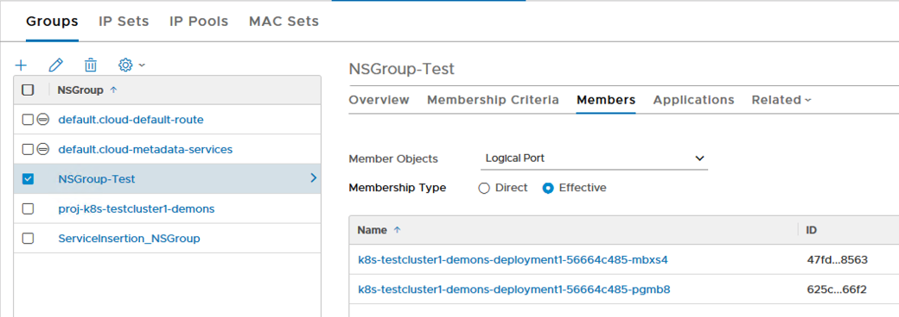
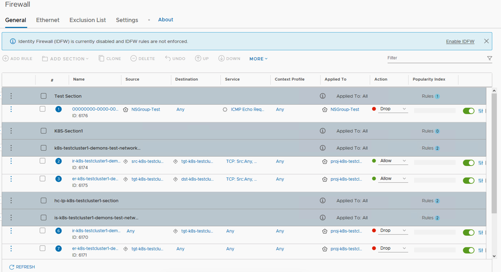

# NSX-T 2.4.x & K8S - PART 6
[Home Page](https://github.com/dumlutimuralp/nsx-t-k8s)

# Table Of Contents

[Current State](#Current-State)   
[K8S Ingress](#K8S-Ingress)   
[K8S Network Policy](#K8S-Network-Policy)   
[DFW Based K8S Pod Security](#DFW-Based-K8S-Pod-Security)  
[Summary](#Summary)

# Current State
[Back to Table of Contents](#Table-Of-Contents)

This article starts off where we left off at the end of Part 5. A deployment with the name "nsxdemoapp" is configured with four replicas, a K8S service type "LoadBalancer" is configured with the name "nsxdemoservice" , all configured in the K8S namespace with the name "demons" . As shown below.

<pre><code>
root@k8s-master:/home/vmware/testymls# <b>kubectl get all -n demons</b>
NAME                              READY   STATUS    RESTARTS   AGE
pod/nsxdemoapp-85d76c598f-9wjpk   1/1     Running   0          5h25m
pod/nsxdemoapp-85d76c598f-plnqf   1/1     Running   0          5h25m
pod/nsxdemoapp-85d76c598f-q5zzz   1/1     Running   0          5h25m
pod/nsxdemoapp-85d76c598f-vpgdb   1/1     Running   0          5h25m

NAME                     TYPE           CLUSTER-IP      EXTERNAL-IP                 PORT(S)        AGE
service/<b>nsxdemoservice</b>   LoadBalancer   <b>10.103.216.59</b>   <b>10.190.6.102</b>,100.64.208.9   <b>80</b>:<b>30657</b>/TCP   4h8m

NAME                         READY   UP-TO-DATE   AVAILABLE   AGE
deployment.apps/<b>nsxdemoapp</b>   4/4     4            4           5h25m

NAME                                    DESIRED   CURRENT   READY   AGE
replicaset.apps/nsxdemoapp-85d76c598f   <b>4</b>         4         4       5h25m
root@k8s-master:/home/vmware/testymls#
</code></pre>

# K8S Ingress
[Back to Table of Contents](#Table-Of-Contents)

K8S ingress is a K8S API object that handles the external HTTP or HTTPS access to different services in the K8S cluster.  Basically ingress is all about <b>layer 7 (OSI) load balancing. </b> i.e. URI based load balancing, SSL termination. 

On K8S [official site](https://kubernetes.io/docs/concepts/services-networking/ingress/) two terms are used; "ingress" and "ingress controller". It may take a while to understand the actual difference between these components after reading those definitions at K8S official site. Simply put "ingress" is the actual layer 7 rules that are configured for steering different requests to different services in the cluster. "ingress controller" on the other hand is the actual load balancer implementation. It could be a Pod, a virtual machine based load balancer solution or physical load balancer. 

Since K8S service type "LoadBalancer" consumes different IPs or TCP/UDP ports for each service, ingress provides a simple way for application developers to expose different services through the well known ports http/https and coupled with URI/path based load balancing it is highly flexible and also easy to scale out.

## Generic K8S

There are different ingress controller solutions in the market. Some of them are listed at Kubernetes website [here](https://kubernetes.io/docs/concepts/services-networking/ingress-controllers/) . In fact as of November 2019 <b>there are three different ingress controller options that VMware offers</b>. One is Contour , the other is AVI Networks (aka NSX-T Advanced Load Balancer) and NSX-T Load Balancer. In this article NSX-T Load Balancer functionality is explained.

## NSX-T Load Balancer as Ingress (Controller) 

Same NSX-T Load Balancer that has been used in Part 5 can also be used as K8S ingress as well. NSX-T supports both "Service Type : LoadBalancer" and also "Ingress Controller" functionality. In fact some of the readers may have already noticed from previous part that there are two virtual servers already configured by default on the NSX-T Load Balancer. Shown below.

These two virtual servers shown above are the default virtual servers provisioned for ingress. One is for http the other for https. 

In this article a very basic http access scenario will be shown. Before moving forward let' s delete all the deployments and services that were configured in Part 5.

<pre><code>
root@k8s-master:/home/vmware/testymls# <b>kubectl delete -f nsxdemoapp.yml -n demons</b>
deployment.apps/nsxdemoapp deleted
root@k8s-master:/home/vmware/testymls# <b>kubectl delete -f lb.yml -n demons</b>
service "nsxdemoservice" deleted
</code></pre>

### NCP Parameters

NCP.ini file explained back in Part 4, has a few configuration parameters that defines how NSX-T Load Balancer can be consumed as K8S ingress controller.

- <b>ingress_mode = hostnetwork/NAT</b> : Defines how the ingress controller (NSX-T Load Balancer) will be configured. Default is NAT. 

- <b>http_and_https_ingress_ip = <ip_address></b> : The IP address that will be used for http and https can be explicitly configured by using this parameter. Default is picking the first available IP from the IP pool specified in "external_ip_pools_lb" parameter. (which is used for Service Type:LoadBalancer VIPs as well)

- <b>default_ingress_class_nsx = False/True</b> : This parameter defines that NSX-T LB will be used as ingress even when the ingress class annotation is missing in the ingress definition. Third party ingress controllers can still be used by annotating ingress class.

- <b>l7_persistence = none/cookie/source_ip</b> : This parameter defines the persistence behaviour of ingress. Default is none. 

- <b>x_forwarded_for = none/insert/replace</b> : This parameter defines whether if the source IP info should be relayed to the destination servers. Default is none.

- <b>"lb_default_cert_path"</b> and <b>"lb_priv_key_path"</b> are parameters used for locating the default certificate to be used for HTTPS load balancing.

### Configuring Ingress

Now it is time to configure ingress. Meaning configuring the rules for layer 7 load balancing. <b>It will be a very vveerry vvvveeeeeerrrrrryyyyy simple example.</b>

- Host : nsxingress.demo.local
- path#1 is /app1 and the requests will be redirected to K8S Service "service1" hence Pods backing the "service1" will respond
- path#2 is /app2 and the requests will be redirected to K8S service "service2" hence Pods backing the "service2" will respond

Following yaml file will be used which includes two deployments, two services and an ingress definition with two rules in it. This yaml file is posted as a file in the Github folder. Just in case you want to use it directly by copy/paste from here then do not forget to remove the "#" at the begining of the highlighted lines below.

<pre><code>
root@k8s-master:/home/vmware/testymls# <b>cat ingressexample.yml</b>
apiVersion: apps/v1
kind: Deployment
metadata:
  name: <b>deployment1</b>
spec:
  selector:
    matchLabels:
      app: <b>app1</b>
  replicas: <b>2</b>
  template:
    metadata:
      labels:
        app: <b>app1</b>
    spec:
      containers:
      - name: <b>nsx-demo</b>
        image: <b>dumlutimuralp/nsx-demo</b>
        ports:
        - containerPort: 80
# --- <b><= REMOVE THE # at the beginning of this line if you want to use this content as yml</b>
apiVersion: apps/v1
kind: Deployment
metadata:
  name: <b>deployment2</b>
spec:
  selector:
    matchLabels:
      app: <b>app2</b>
  replicas: <b>2</b>
  template:
    metadata:
      labels:
        app: <b>app2</b>
    spec:
      containers:
      - name: <b>nsx-demo</b>
        image: <b>dumlutimuralp/nsx-demo</b>
        ports:
        - containerPort: 80
# --- <b><= REMOVE THE # at the beginning of this line if you want to use this content as yml</b>
apiVersion: v1
kind: Service
metadata:
  name: <b>service1</b>
  labels:
    app: service1
spec:
  type: <b>LoadBalancer</b>
  selector:
    app: <b>app1</b>
  ports:
  - name: http
    protocol: TCP
    port: 80
    targetPort: 80
# --- <b><= REMOVE THE # at the beginning of this line if you want to use this content as yml</b>
apiVersion: v1
kind: Service
metadata:
  name: <b>service2</b>
  labels:
    app: service2
spec:
  type: <b>LoadBalancer</b>
  selector:
    app: <b>app2</b>
  ports:
  - name: http
    protocol: TCP
    port: 80
    targetPort: 80
# --- <b><= REMOVE THE # at the beginning of this line if you want to use this content as yml</b>
apiVersion: extensions/v1beta1
kind: <b>Ingress</b>
metadata:
  name: <b>nsxingress</b>
  namespace: <b>demons</b>
  annotations:
    <b>ingress.kubernetes.io/rewrite-target: /</b>
spec:
  rules:
  - host: nsxingress.demo.local
    http:
      paths:
      - path: <b>/app1</b>
        backend:
          serviceName: <b>service1</b>
          servicePort: 80
      - path: <b>/app2</b>
        backend:
          serviceName: <b>service2</b>
          servicePort: 80
root@k8s-master:/home/vmware/testymls#
</code></pre>

Let' s check the individual services and ingress.

<pre><code>
root@k8s-master:/home/vmware/testymls# <b>kubectl describe service service1 -n demons</b>
Name:                     <b>service1</b>
Namespace:                demons
Labels:                   app=service1
Annotations:              ncp/internal_ip_for_policy: 100.64.208.9
Selector:                 <b>app=app1</b>
Type:                     <b>LoadBalancer</b>
IP:                       10.104.227.178
LoadBalancer Ingress:     10.190.6.101, 100.64.208.9
Port:                     http  80/TCP
TargetPort:               80/TCP
NodePort:                 http  32480/TCP
Endpoints:                <b>172.25.5.3:80,172.25.5.7:80</b>
Session Affinity:         None
External Traffic Policy:  Cluster
Events:                   <none>
root@k8s-master:/home/vmware/testymls# <b>kubectl describe service service2 -n demons</b>
Name:                     <b>service2</b>
Namespace:                demons
Labels:                   app=service2
Annotations:              ncp/internal_ip_for_policy: 100.64.208.9
Selector:                 <b>app=app2</b>
Type:                     <b>LoadBalancer</b>
IP:                       10.106.93.34
LoadBalancer Ingress:     10.190.6.102, 100.64.208.9
Port:                     http  80/TCP
TargetPort:               80/TCP
NodePort:                 http  31420/TCP
Endpoints:                <b>172.25.5.2:80,172.25.5.4:80</b>
Session Affinity:         None
External Traffic Policy:  Cluster
Events:                   <none>
root@k8s-master:/home/vmware/testymls# <b>kubectl describe ingress nsxingress -n demons</b>
Name:             nsxingress
Namespace:        demons
Address:          <B>10.190.6.100</b>,100.64.208.9
Default backend:  default-http-backend:80 (<none>)
Rules:
  Host                   Path  Backends
  ----                   ----  --------
  <b>nsxingress.demo.local</b>
                         <b>/app1   service1:80 (172.25.5.3:80,172.25.5.7:80)</b>
                         <b>/app2   service2:80 (172.25.5.2:80,172.25.5.4:80)</b>
Annotations:
  ingress.kubernetes.io/rewrite-target:  /
  <b>ncp/internal_ip_for_policy:            100.64.208.9</b>
Events:                                  <none>
root@k8s-master:/home/vmware/testymls#
</code></pre>

As shown below, request made to /app1 gets a response from the Pod part of service1 and the same for /app2 which gets a response from the Pod part of service2. 

<b>Note :</b>The image on the page may not come up since it is harcoded in php. 

Basically the requests get redirected to different K8S services at the backend based on the path. There is a trick applied in the ingress definitions which is "ingress.kubernetes.../rewrite-target: /" piece, basically stripping out the specific path at the end and just sends a request to / path. 

There are many other features of K8S Ingress and NSX-T' s implementation of those capabilities such as TLS termination, URI rewrite, header manipulation etc. In this article a very simple example is shown.

Let' s check what has been automatically configured on NSX-T side.

As shown above, there are the two services configured with their own respective LoadBalancer VIPs. 

In the above screenshoot, the URI forwarding rules are shown. /app1 -> service1 pool and /app2 -> service2 pool

Above, the individual pool members of service1 is shown.

# K8S Network Policy
[Back to Table of Contents](#Table-Of-Contents)

Network policy is a definition of how Pods should communicate with each other. As usual more details are at Kubernetes site [here](https://kubernetes.io/docs/concepts/services-networking/network-policies/) . Network policies rely on labels to select Pods to which the allow rules should be applied.

By default all communication to/from Pods are allowed. A Pod would become isolated as soon as a Network policy selects it. Ingress and egress rules can be configured with network policies.

Two simple ingress policy examples that are also mentined at Kubernetes site is as follows. "Ingress" is from Pod' s point of view. The traffic coming into a Pod.

<b>Default Deny All Ingress Policy</b>

<pre><code>
apiVersion: networking.k8s.io/v1
kind: NetworkPolicy
metadata:
  name: default-deny
spec:
  podSelector: {}
  policyTypes:
  - Ingress
</code></pre>

<b>Default Allow All Ingress Policy</b>

<pre><code>
apiVersion: networking.k8s.io/v1
kind: NetworkPolicy
metadata:
  name: allow-all
spec:
  podSelector: {}
  policyTypes:
  - Ingress
  ingress:
  <b>- {}</b>
</code></pre>

### NCP Parameters

NCP.ini. file mentioned back in Part 4, has a few configuration parameters that defines how NSX-T Distributed Firewall can be consumed by K8S Network Policies.

- <b>log_dropped_traffic = True/False :</b> This parameter specifies whether if the NSX distributed firewall rules configured by NCP (hence the K8S Network Policy)  should log denied traffic. Default is false.

- <b>top_firewall_section_marker = <None> :</b> This parameter defiines the beginning of the distributed firewall section specific to this K8S cluster. Configuring a name here is highly encouraged. In this lab it is configured with the name "Section1". Which is not descriptive :) . It should have been configured as something like "Section Begin for K8S Cluster#1" or something along those lines.
   
- <b>bottom_firewall_section_marker = <None> :</b> This parameter defines the end of the distributed firewall section specific to this K8S cluster. Configuring a name here is highly encouraged. In this lab it is configured with the name "Section2". Which is not descriptive :) . It should have been configured as something like "Section End for K8S Cluster#1" or something along those lines.

## Current State 

The existing state of the NSX- Distributed Firewall rule base is as shown below.

As seen above, there is actually an additional section that is provisioned with the integration of NSX-T with this K8S cluster. The section named as "hc-lp-k8s-cluster1-section". Remember the IP addresses configured in those two rules ? Those rules actually define and allow the traffic from the K8S Nodes to  the CoreDNS pods to check the liveness of those Pods. (Liveness probes were mentioned in the previous part, Part 5. It is easy to check the liveness and readiness probe configuration of a pod by issuing "kubectl descrtibe pod/<pod-name>" and in the output there are specific fields as "Liveness" and "Readiness". 

### K8S Network Policy Example #1

A sample isolation policy will be applied to all the Pods which has the label "app: app1" . In this lab those are the pods which are part of deployment named as "deployment1". 

<pre><code>
root@k8s-master:/home/vmware/testymls#<b>cat policy1.yml</b>
apiVersion: networking.k8s.io/v1
kind: <b>NetworkPolicy</b>
metadata:
  name: <b>default-deny</b>
spec:
  podSelector: 
    matchLabels:
      <b>app: app1</b>
  policyTypes:
  - <b>Ingress</b>
root@k8s-master:/home/vmware/testymls#
root@k8s-master:/home/vmware/testymls#<b>kubectl get pods -o wide -n demons</b>
NAME                           READY   STATUS    RESTARTS   AGE   IP           NODE        NOMINATED NODE   READINESS GATES
<b>deployment1</b>-56664c485-mbxs4    1/1     Running   0          13h   <b>172.25.5.7</b>   k8s-node2   <none>           <none>
<b>deployment1</b>-56664c485-pgmb8    1/1     Running   0          13h   <b>172.25.5.3</b>   k8s-node1   <none>           <none>
deployment2-7558b48474-7xsrv   1/1     Running   0          13h   172.25.5.4   k8s-node2   <none>           <none>
deployment2-7558b48474-slr6d   1/1     Running   0          13h   172.25.5.2   k8s-node1   <none>           <none>
root@k8s-master:/home/vmware/testymls#
root@k8s-master:/home/vmware/testymls#<b>kubectl create -f policy1.yml -n demons</b>
<b>networkpolicy.networking.k8s.io/default-deny created</b>
</code></pre>

As shown above, there are two sections added to the rule base. One at the bottom one at the top. The logic here is the isolation rules are applied at the bottom of the K8S cluster section as "is-k8s-testcluster1-demons-default-deny" and specific network policy rules are applied at the top of the K8S cluster section as "k8s-testcluster1-demons-default-deny" in this screenshot. Since in the yaml file there were no specific policies configured there are no rules configured in "k8s-testcluster1-demons-default-deny" section. 

Here is the interesting part, in the isolation rules section, which is "is-k8s-testcluster1-demons-default-deny", there are two rules. One starts with "ir-..." which stands for "ingress rule" and the other starts with "er-..." which stands for "egress rule". The reason the ingress rule is configured as "drop" and egress rule is configured as "allow" is, in the yaml file , in the "policyTypes" section, "Ingress" is mentioned but without any specific rules. <b>This means deny all ingress traffic. K8S network policy logic is based on "whitelisting" </b> 

On the other hand, in the yaml file, in the "policyTypes" section, there is no mention of "Egress", that means allow all traffic for egress. Hence corresponding rules have been configured on the rule base.

When the IPset "tgt=k8s-testcluster1-demons" is clicked on one of these rules, it can be seen that both Pods with the label "app: app1" are part of this NSgrup. Shown below.

The interesting part is though the NSGroup which these firewall rules are applied to is "proj-k8s-testcluster1-demons" . This NSgroup is actually representing all the workloads connected to the "demons" logical switch. Shown in below screenshots. Second screenshot below shows the actual matching criterias for the NSGroup. (which basically defines demons namespace in k8s-testcluster1) 

This means that these rules are applied to each workload connected to that logical switch. However since the actual IPsets, that are used in those rules, are comprised of the IP addresses of the Pods that are part of deployment1 only.

Let's delete the existing policy and test another one. 

<pre><code>
root@k8s-master:/home/vmware/testymls#<b>kubectl delete -f policy1.yml -n demons</b>
<b>networkpolicy.networking.k8s.io/default-deny delete</b>
</code></pre>

### K8S Network Policy Example #2

A sample  will be applied to all the Pods which has the label "app: app2" this time . In this lab those are the pods which are part of deployment named as "deployment2".

<pre><code>
root@k8s-master:/home/vmware/testymls#<b>cat policy2.yml</b>
apiVersion: networking.k8s.io/v1
kind: <b>NetworkPolicy</b>
metadata:
  name: <b>test-network-policy</b>
  namespace: <b>demons</b>
spec:
  podSelector:
    <b>matchLabels:</b>
      <b>app: app2</b>
  policyTypes:
  - Ingress
  - Egress
  <b>ingress:</b>
  - from:
    - ipBlock:
        cidr: 192.168.2.0/24
    - namespaceSelector:
        matchLabels:
          project: demons
    - podSelector:
        matchLabels:
          <b>app: app1</b>
    ports:
    - protocol: TCP
      port: 80
  <b>egress:</b>
  - to:
    - ipBlock:
        cidr: <b>172.25.5.0/24</b>
    ports:
    - protocol: TCP
      port: 80
root@k8s-master:/home/vmware/testymls#
root@k8s-master:/home/vmware/testymls#<b>kubectl get pods -o wide -n demons</b>
NAME                           READY   STATUS    RESTARTS   AGE   IP           NODE        NOMINATED NODE   READINESS GATES
deployment1-56664c485-mbxs4    1/1     Running   0          23h   172.25.5.7   k8s-node2   <none>           <none>
deployment1-56664c485-pgmb8    1/1     Running   0          23h   172.25.5.3   k8s-node1   <none>           <none>
<b>deployment2</b>-7558b48474-7xsrv   1/1     Running   0          23h   <b>172.25.5.4</b>   k8s-node2   <none>           <none>
<b>deployment2</b>-7558b48474-slr6d   1/1     Running   0          23h   <b>172.25.5.2</b>   k8s-node1   <none>           <none>
root@k8s-master:/home/vmware/testymls#
root@k8s-master:/home/vmware/testymls#<b>kubectl create -f policy2.yml -n demons</b>
<b>networkpolicy.networking.k8s.io/test-network-policy created</b>
</code></pre>

Let' s dissect the yaml spec, shown above, first. 

This network policy selects the Pods which has the label "app: app2" in "demons" namespace. Meaning that the ingress and egress rules in this policy are supposed too be applied on Pods that are part of deployment2. 

Basically any traffic that comes from either the subnet 192.168.2.0/24 or any Pod which has a label "app: app1" will be allowed on TCP 80, cause these parameters are defined in "ingress:" section. 

In "egress:" section, traffic going to subnet 172.25.5.0/24 is allowed on TCP 80. 

Let' s see how these rules are reflected on NSX-T Distributed Firewall rule base.

As seen above, similar logic, as in example 1, applies here. The default rule at the bottom does not fit in this screenshot; it is still any any allow.

One difference compared too example#1 is, in the isolation section at the bottom, named as "is-k8s-testcluster1-demons-test-network-policy", both rules are ccoonfigured as "Drop". The reason is, as mentioned before, the K8S network policy logic is based on "whitelisting" . Since specific ingress and egress rules are configured in this yaml spec, only the traffic matching those rules will be allowed, as shown in section named as "k8s-testcluster1-demons-test-network-policy" at the top of the NSX-T Distributed Firewall rule base.

The IPsets that are configured based on the K8S network policy is shown below.

The NSGroup configured as part of this network policy is based on all the workloads part of "demons" namespace is shown below.

The IPsets that are configured in the respective NSX-T Distributed Firewall rules are using the Pods IP addresses (which are part of deployment2) but these firewall rules are applied to all the workloads that are connected to "demons" namespace. 

With this K8S network policy, the expected behaviour would be as following : 

- Only the Pods that are part of deployment1 and only source IP 192.168.2.0/24 can access TCP 80 on the Pods part of deployment2
- Pods that are part of deployment2 can access TCP 80 on destination IP subnet 172.25.5.0/24
- Any other traffic destined to Pods that are part of deployment2 is dropped
- Any other traffic generated by Pods that are part of deployment2 is dropped

Let' s validate this behaviour. 

<pre><code>
root@k8s-master:/home/vmware/testymls# kubectl get pods -o wide -n demons
NAME                           READY   STATUS    RESTARTS   AGE   IP           NODE        NOMINATED NODE   READINESS GATES
deployment1-56664c485-mbxs4    1/1     Running   0          24h   172.25.5.7   k8s-node2   <none>           <none>
deployment1-56664c485-pgmb8    1/1     Running   0          24h   172.25.5.3   k8s-node1   <none>           <none>
deployment2-7558b48474-7xsrv   1/1     Running   0          24h   172.25.5.4   k8s-node2   <none>           <none>
deployment2-7558b48474-slr6d   1/1     Running   0          24h   172.25.5.2   k8s-node1   <none>           <none>
root@k8s-master:/home/vmware/testymls# kubectl exec -it deployment1-56664c485-pgmb8 -n demons bash
root@deployment1-56664c485-pgmb8:/app#
root@deployment1-56664c485-pgmb8:/app# <b>curl 172.25.5.4</b>
OUTPUT OMITTED
Hello, this web-page is served by: deployment2-7558b48474-7xsrv
The containers private IP is: 172.25.5.4
OUTPUT OOMITTED
root@deployment1-56664c485-pgmb8:/app# <b>curl 172.25.5.2</b>
OUTPUT OMITTED
Hello, this web-page is served by: deployment2-7558b48474-7xsrv
The containers private IP is: 172.25.5.4
OUTPUT OMITTED
root@deployment1-56664c485-pgmb8:/app#
</code></pre>

As shown above, Pods that are part of deployment1 can access Pods that are part of deployment2 on TCP 80. 

When the same test is performed from a client which has source ip of 192.168.1.182 /24, Pods that are part of deployment2 cannot be accessed. As shown below.

Pods that are part of deployment2 can access 172.25.5.0/24 on TCP 80. However cannot access anywhere else. Shown below.

<pre><code>
root@k8s-master:/home/vmware/testymls# kubectl get pods -o wide -n demons
NAME                           READY   STATUS    RESTARTS   AGE   IP           NODE        NOMINATED NODE   READINESS GATES
deployment1-56664c485-mbxs4    1/1     Running   0          24h   172.25.5.7   k8s-node2   <none>           <none>
deployment1-56664c485-pgmb8    1/1     Running   0          24h   172.25.5.3   k8s-node1   <none>           <none>
deployment2-7558b48474-7xsrv   1/1     Running   0          24h   172.25.5.4   k8s-node2   <none>           <none>
deployment2-7558b48474-slr6d   1/1     Running   0          24h   172.25.5.2   k8s-node1   <none>           <none>
root@k8s-master:/home/vmware/testymls# kubectl exec -it deployment2-7558b48474-slr6d -n demons bash
root@deployment2-7558b48474-slr6d:/app#
root@deployment2-7558b48474-slr6d:/app# <b>curl 172.25.5.7</b>
Hello, this web-page is served by: deployment1-56664c485-mbxs4
The containers private IP is: 172.25.5.7
root@deployment2-7558b48474-slr6d:/app# <b>curl 172.25.5.3</b>
OUTPUT OMITTED
Hello, this web-page is served by: deployment1-56664c485-pgmb8
The containers private IP is: 172.25.5.3
OUTPUT OMITTED
root@deployment2-7558b48474-slr6d:/app#
root@deployment2-7558b48474-slr6d:/app# <b>curl www.google.com</b>
^C
root@deployment2-7558b48474-slr6d:/app# <b>ping 8.8.8.8</b>
PING 8.8.8.8 (8.8.8.8): 56 data bytes
^C--- 8.8.8.8 ping statistics ---
<b>7 packets transmitted, 0 packets received</b>, 100% packet loss
root@deployment2-7558b48474-slr6d:/app#
</code></pre>

# DFW Based K8S Pod Security
[Back to Table of Contents](#Table-Of-Contents)

An NSX admin can still use the K8S labels and other metadata to apply distributed firewall rules to the K8S Pods, regardless of the use of K8S network policies. The approach each organization takes on this may vary. A hybrid model usually makes sense. 

Imagine a firewall rule base in which the first section is "Emergency Rules" for fail safe, then "Infrastructure Rules" for AD, DNS, NTP, Remediation Server access, then "Inter Zone Rules" for isolating zones from each other at a macro level and then "Application Level Rules" to microsegment applications from each other. The NSX admin can leverage K8S labels to isolate zones from each other but yet at the same time allow the developers to push application level rules in the appropriate section.

As mentioned in previous parts, each logical port on NSX-T logical switch, to which a K8S Pod is connected to, gets populated with the K8S metadata. As shown below. 

Hence any kind of NSGroup can be configured based on those tags. An example is shown below.

This NSGroup can be used in its own firewall rule. The rule at the top shown below. Once that top rule is enabled, the ICMP echo requests from a Pod in deployment1 will start to get blocked. Notice that the "Applied To" field for the rule at the top is coonfigured also as that "NSGroup-Test".

<pre><code>
root@k8s-master:/home/vmware/testymls# kubectl get pods -o wide -n demons
NAME                           READY   STATUS    RESTARTS   AGE   IP           NODE        NOMINATED NODE   READINESS GATES
deployment1-56664c485-mbxs4    1/1     Running   0          24h   172.25.5.7   k8s-node2   <none>           <none>
deployment1-56664c485-pgmb8    1/1     Running   0          24h   172.25.5.3   k8s-node1   <none>           <none>
deployment2-7558b48474-7xsrv   1/1     Running   0          24h   172.25.5.4   k8s-node2   <none>           <none>
deployment2-7558b48474-slr6d   1/1     Running   0          24h   172.25.5.2   k8s-node1   <none>           <none>
root@k8s-master:/home/vmware/testymls# <b>kubectl exec -it deployment1-56664c485-mbxs4 -n demons bash</b>
root@deployment1-56664c485-mbxs4:/app# <b>ping 8.8.8.8</b>
PING 8.8.8.8 (8.8.8.8): 56 data bytes
64 bytes from 8.8.8.8: icmp_seq=0 ttl=55 time=22.983 ms
64 bytes from 8.8.8.8: icmp_seq=1 ttl=55 time=20.085 ms
64 bytes from 8.8.8.8: icmp_seq=2 ttl=55 time=20.022 ms
64 bytes from 8.8.8.8: icmp_seq=3 ttl=55 time=21.651 ms
64 bytes from 8.8.8.8: icmp_seq=4 ttl=55 time=20.754 ms
64 bytes from 8.8.8.8: icmp_seq=5 ttl=55 time=21.022 ms
64 bytes from 8.8.8.8: icmp_seq=6 ttl=55 time=20.264 ms
^C--- 8.8.8.8 ping statistics ---
<b>14 packets transmitted, 7 packets received</b>, 50% packet loss
round-trip min/avg/max/stddev = 20.022/20.969/22.983/0.982 ms
root@deployment1-56664c485-mbxs4:/app#
</code></pre>

As shown above once the DFW rule is enabled ICMP traffic gets droopped. (%50 packet loss)

# Summary

K8S Ingress Controller and K8S Network policy model is explained in this article. The way how NSX DFW also consumes the K8S metadata (labels) is also detailed.
